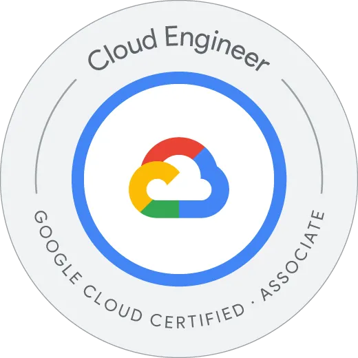
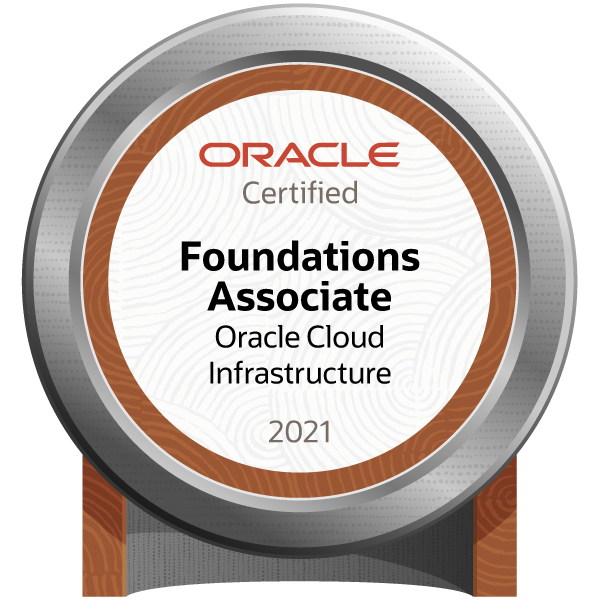
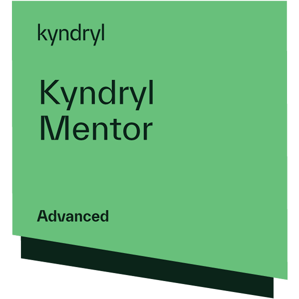
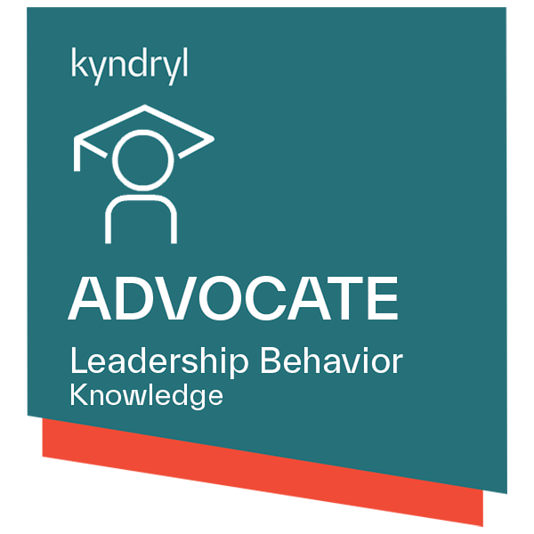

|              [*Associate Cloud Engi...*](https://www.credential.net/dfb890e4-b562-44b1-a569-0b3956d946ae "Associate Cloud Engineer")              |                                                        [*Microsoft Certified...*](https://www.credly.com/badges/ebe2bc85-e54f-480f-a488-e8cb413c6081/public_url "Microsoft Certified: DevOps Engineer Expert")                                                        |                                                  [*AWS Certified D…*](https://www.credly.com/badges/0a0fcca0-fe1a-4f62-8443-02ac5a571830/public_url "AWS Certified Developer – Associate")                                                   |                             [*Microsoft Certified...*](https://www.credly.com/badges/44ae5482-8f6b-4817-843f-6e1fa755d8d1/public_url "Microsoft Certified: Developer Associate")                              |                          [*Microsoft Certified...*](https://www.credly.com/badges/4203e615-de6a-4594-b3df-f9e32c330513/public_url "Microsoft Certified: Azure Fundamentals")                          |                             [*OCI Developer…*](https://catalog-education.oracle.com/pls/certview/sharebadge?id=F8ADB406059AD5F89C48E46A29842F119CE4C9DF6D93EFD15658F6B422A1F4F7 "OCI Developer 2021 Associate")                              |
|:-------------------------------------------------------------------------------------------------------------------------------------------------:|:---------------------------------------------------------------------------------------------------------------------------------------------------------------------------------------------------------------------------------------------------------------------:|:--------------------------------------------------------------------------------------------------------------------------------------------------------------------------------------------------------------------------------------------:|:-------------------------------------------------------------------------------------------------------------------------------------------------------------------------------------------------------------:|:-----------------------------------------------------------------------------------------------------------------------------------------------------------------------------------------------------:|:--------------------------------------------------------------------------------------------------------------------------------------------------------------------------------------------------------------------------------------------:|
|  |  |  |  |  |  |
|             <i>Issued by</i>              |                                                                          <i>Issued by</i>                                                                           |                                                                        <i>Issued by</i>                                                                         |                                              <i>Issued by</i>                                               |                                          <i>Issued by</i>                                           |                                                               <i>Issued by</i>                                                                 |

|                         [*OCI Foundations…*](https://catalog-education.oracle.com/pls/certview/sharebadge?id=B1DAF90CBBBB1B824BBBC8F95A1F2F03A1AC63D4C1B56CC746D19443AFD5B257 "OCI Foundations 2021 Associate")                         |                                                               [*IBM Cloud Esse…*](https://www.credly.com/badges/1e7d3f64-a1eb-460e-b724-503d53b5bfc2/public "IBM Cloud Essentials")                                                               |                                                        [*Docker Essenti…*](https://www.credly.com/badges/e62ba2f1-8436-4406-8682-593f17bc8a41/public "Docker Essentials")                                                        |                                                      [*Data Analysis U…*](https://www.credly.com/badges/55d3906e-f58e-4c3b-b7d6-b7e05bddb6e4/public_url "Data Analysis Using Python")                                                       |                                                        [*Data Visualizati…*](https://www.credly.com/badges/bc167211-31a0-4f5d-98c3-978a91ce0361/public_url "Data Visualization Using Python")                                                         |                                                            [*Node-RED: basi…*](https://www.credly.com/badges/fe3f3e74-9aed-49d1-bcd4-bdcee734bfdb/public "Node-RED: basics to bots")                                                            |
|:---------------------------------------------------------------------------------------------------------------------------------------------------------------------------------------------------------------------------------------:|:-------------------------------------------------------------------------------------------------------------------------------------------------------------------------------------------------------------------------------------------------:|:--------------------------------------------------------------------------------------------------------------------------------------------------------------------------------------------------------------------------------:|:-------------------------------------------------------------------------------------------------------------------------------------------------------------------------------------------------------------------------------------------:|:-----------------------------------------------------------------------------------------------------------------------------------------------------------------------------------------------------------------------------------------------------:|:-----------------------------------------------------------------------------------------------------------------------------------------------------------------------------------------------------------------------------------------------:|
|  |  |  |  |  |  |
|                                                             <i>Issued by</i>                                                              |                                                                            <i>Issued by</i>                                                                             |                                                                   <i>Issued by</i>                                                                     |                                                                         <i>Issued by</i>                                                                          |                                                                              <i>Issued by</i>                                                                               |                                                                           <i>Issued by</i>                                                                            |

|                  [*Kyndryl Mentor*](https://www.credly.com/badges/034af18b-5e67-4cb3-8f95-fe97b5f8b153/public_url "Kyndryl Mentor")                  |                       [*Leadership Beh...*](https://www.credly.com/badges/bd1cfa58-a995-4218-a266-84fbe7922468/public_url "Leadership Behavior - Advocate")                        |                                                            [*DevSecOps Es…*](https://www.credly.com/badges/e9a21439-7d0f-4046-8c84-42cd1fa9c71a/public_url "Containers, Kubernetes and OpenShift V2")                                                            |                                                     [*DevSecOps Es…*](https://www.credly.com/badges/63625867-cf8c-4ae3-a8f0-dfcc060fdd2e/public_url "DevSecOps Essentials")                                                     |                                                        [*Enterprise Desi…*](https://www.credly.com/badges/f35df941-bf87-468f-b3bc-8783fb0622e6/public "Enterprise Design Thinking Practitioner")                                                        |                                                  [*IBM Agile Explo…*](https://www.credly.com/badges/7544a31e-a1f6-4121-bae1-9bb3629be0f0/public_url "IBM Agile Explorer")                                                   |
|:----------------------------------------------------------------------------------------------------------------------------------------------------:|:----------------------------------------------------------------------------------------------------------------------------------------------------------------------------------:|:----------------------------------------------------------------------------------------------------------------------------------------------------------------------------------------------------------------------------------------------------------------:|:-------------------------------------------------------------------------------------------------------------------------------------------------------------------------------------------------------------------------------:|:-------------------------------------------------------------------------------------------------------------------------------------------------------------------------------------------------------------------------------------------------------:|:---------------------------------------------------------------------------------------------------------------------------------------------------------------------------------------------------------------------------:|
|  |  |  |  |  |  |
|                     <i>Issued by</i>                       |                                    <i>Issued by</i>                                      |                                                                                   <i>Issued by</i>                                                                                     |                                                                   <i>Issued by</i>                                                                    |                                                                               <i>Issued by</i>                                                                                |                                                                 <i>Issued by</i>                                                                  |